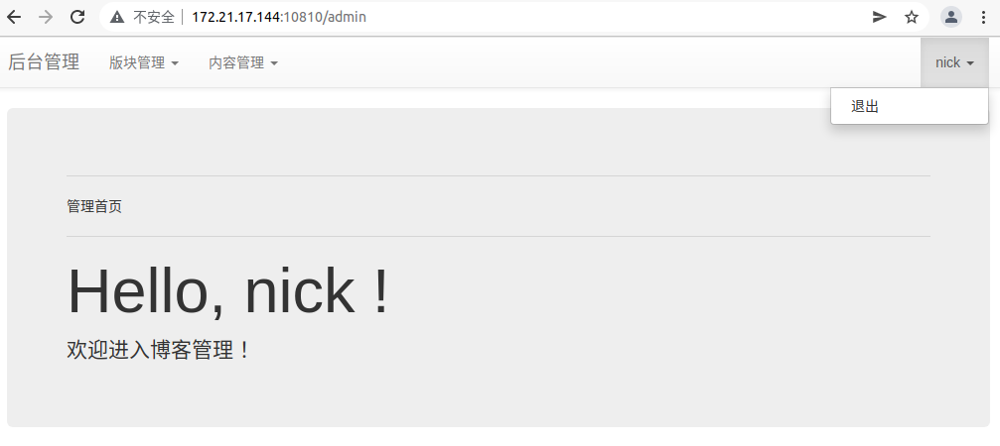

# 项目名称：个人博客系统

1）项目设计部分：

（1）项目总体构成:

主要由nodejs文件和html文件构成，其他的还有配置文件和图片。

（2）引入的包在项目中的作用相关说明:

body-parser:   解析客户端请求的body中的内容

cookies：让我们用同一个浏览器访问同一个域名的时候共享数据

express:   基于Node.js的Web开发框架

mongoose:   在nodejs环境下，对mongodb进行便捷操作的对象模型工具

bootstrap-3.3.7:  网页布局框架  

（3）项目目录结构和各个部分的说明：

models : 保存数据库模型文件

node_modules: 安装文件夹

public/css: 网页style的css文件夹

public/images:存放图片文件

public/js:存放一些通用js文件

public/plug-in；外部导入包文件夹

router:存放路由js文件

schemas:存放创建数据表的js 文件

views:存放所有项目用到的html文件

app.js:项目入口

package-lock.json

package.json:配置文件

readme.md

2）使用说明书：

支持用户注册/登录，内容文章查看，评论，后台管理 ，超级管理员还可进行用户管理。

注册/登录在首页就能找到按钮，标题与简介在首页也可以看见，但是具体内容要带点击标题查看，发表评论也是如此。但是由于一些bug原因评论功能没能完善。后台管理在登陆后就会出现入口，里面的具体操作在导航栏都可以看见。退出按钮在右上角。

3）开发日记：

该项目进行了github版本管理，每一阶段完成后会与远程仓库同步。